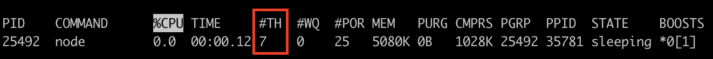

# 浅析Node的单线程

我们都知道，Node是单线程的，连官方的说明文档都是这样说明的：

```
A Node.js app is run in a single process, without creating a new thread for every request.
```

但是，Node真的是单线程吗？我一直有这样的疑问。我们来看下Node的是否真的是单线程的。

首先我们启动一个Node程序：

```javascript
require('http').createServer((req, res) => {
  res.writeHead(200);
  res.end('Hello World');
}).listen(8000);
console.log('process id', process.pid);
```

启动Node应用后，我们使用top（top -pid xxxx）指令查看应用详情：



我们可以看到，启动的Node应用实际有7个线程，那这分别是什么线程呢？作用是什么呢？

事实上一个 Node 进程通常包含：1 个 Javascript 执行主线程；1 个 watchdog 监控线程用于处理调试信息；1 个 v8 task scheduler 线程用于调度任务优先级，加速延迟敏感任务执行；4 个 v8 线程，主要用来执行代码调优与 GC 等后台任务；以及用于异步 I/O 的 libuv 线程池。

 所以这里所谓的单线程其实是指JavaScript的执行主线程是单线程，那么为什么JavaScript的执行主线程是单线程？作为浏览器脚本语言，JavaScript的主要用途是与用户互动，以及操作DOM。这决定了它只能是单线程，否则会带来很复杂的同步问题。比如：假定JavaScript同时有两个线程，一个线程在某个DOM节点上添加内容，另一个线程删除了这个节点，这时浏览器应该以哪个线程为准？由于JavaScript的使用场景，为了避免由于多线程导致的复杂性，JavaScript选择了单线程的模式，将来也不会改变。

## 为什么这样设计？

单线程有很多的优点：

1. 架构设计简单，易维护
2. 没有上下文切换带来的复杂性和开销