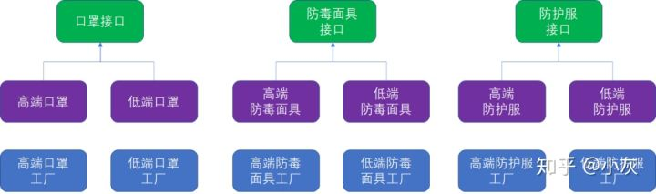
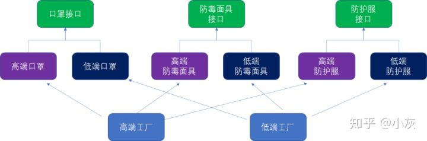

# 工厂模式

工厂模式是三种功能接近的设计模式的统称，分别是：

- 简单工厂模式
- 工厂方法模式
- 抽象工厂模式

创建对象时需要一系列复杂的初始化操作（关了其他成员对象、查询配置文件、查询数据库等），此时可以考虑使用工厂模式。

## 简单工厂模式

定义口罩类：

```java
public interface IMask {
    void show();
}

public class HighEndMask implements IMask {
    @Override
    public void show() {
        System.out.println("我是高端口罩");
    }
}

public class LowEndMask implements IMask {
    @Override
    public void show(){
        System.out.println("我的低端口罩");
    }
}
```

定义工厂类：

```java
public class MaskFactory{

    public IMask createMask(String type) {
        IMask mask = null;
        if("高端口罩".equals(type)){
            mask = new HighEndMask();
            // .....
            // HighEndMask的100行初始化代码
        }else if("低端口罩".equals(type)){
            mask =  new LowEndMask();
            // .....
            // LowEndMask的100行初始化代码
        }
        return mask;
    }
}
```

使用工厂类创建口罩对象：

```java
public class Test {

    public static void main(String[] args) {
        MaskFactory factory = new MaskFactory();
        IMask maskA = factory.createMask("高端口罩");
        IMask maskB = factory.createMask("低端口罩");
        maskA.show();
        maskB.show();
    }
}
```

想上面这样通过工厂类创建对象，并且根据入参决定具体子类对象的方法，就是简单工厂模式。

简单工厂模式有唯一的工厂类，工厂类的创建方法根据传入的参数做if-else条件判断，决定最终创建什么样的产品对象。

## 工厂方法模式

上面的工厂类，随着需要创建的子类的增加，创建方法中的if-else会越来越多，使代码变得复杂，不便于理解。

重构上面的工厂类方法：

```java
public interface IMaskFactory {
    IMask createMask();
}

public class HighEndFactory implements IMaskFactory{

    @Override
    public IMask createMask() {
        IMask mask =  new HighEndMask();
        // .....
        // HighEndMask的100行初始化代码
        return mask;
    }
}

public class LowEndFactory implements IMaskFactory{

    @Override
    public IMask createMask() {
        IMask mask =  new LowEndMask();
        // .....
        //  LowEndMask的100行初始化代码
        return mask;
    }
}
```

重构后的代码扩展性更好，对于新的子类，只需要实现新的IMaskFactory接口即可，避免对抽象工厂类的修改。像这样通过多个工厂类实现工厂接口，利用多态来创建不同产品对象的方法，就是工厂方法模式。

工厂方法模式由多个工厂类实现工厂接口，利用多态来创建不同的产品对象，从而避免了冗长的if-else条件判断。

注：所谓面向对象的开放-封闭原则，就是在程序中对“扩展”开放，对“修改”封闭。如果每次业务改动都要增加新的if-else，就涉及对旧有代码的修改，不但容易出错，可读性也不好。

## 抽象工厂模式

业务中需要创建口罩、防毒面具、防护服这三种产品，而每一种产品有包含高端和低端两类，按照工厂方法模式的解决方案，需要创建的类如下：



对产品进行分组：



把产品类分组，组内不同产品对应同已工厂类不同方法的设计模式，就是抽象工厂模式。

```java
public interface IMask {
    void showMask();
}

public class LowEndMask implements IMask {
    @Override
    public void showMask(){
        System.out.println("我的低端口罩");
    }
}

public class HighEndMask implements IMask {
    @Override
    public void showMask() {
        System.out.println("我是高端口罩");
    }
}

public interface IProtectiveSuit {
    void showSuit();
}

public class LowEndProtectiveSuit implements IProtectiveSuit {
    @Override
    public void showSuit() {
        System.out.println("我是低端防护服");
    }
}

public class HighEndProtectiveSuit implements IProtectiveSuit {
    @Override
    public void showSuit() {
        System.out.println("我是高端防护服");
    }
}
```

```java
public interface IFactory {
    //创建口罩
    IMask createMask();
    //创建防护服
    IProtectiveSuit createSuit();
}

public class LowEndFactory implements IFactory {
    @Override
    public IMask createMask() {
        IMask mask =  new LowEndMask();
        // .....
        //  LowEndMask的100行初始化代码
        return mask;
    }

    @Override
    public IProtectiveSuit createSuit() {
        IProtectiveSuit suit =  new LowEndProtectiveSuit();
        // .....
        //  LowEndProtectiveSuit的100行初始化代码
        return suit;
    }
}

public class HighEndFactory implements IFactory {
    @Override
    public IMask createMask() {
        IMask mask =  new HighEndMask();
        // .....
        // HighEndMask的100行初始化代码
        return mask;
    }

    @Override
    public IProtectiveSuit createSuit() {
        IProtectiveSuit suit =  new HighEndProtectiveSuit();
        // .....
        //  HighEndProtectiveSuit的100行初始化代码
        return suit;
    }
}
```

抽象工厂模式把产品子类进行分组，同组中的不同产品由同一个工厂子类的不同方法负责创建，从而减少了工厂子类的数量。